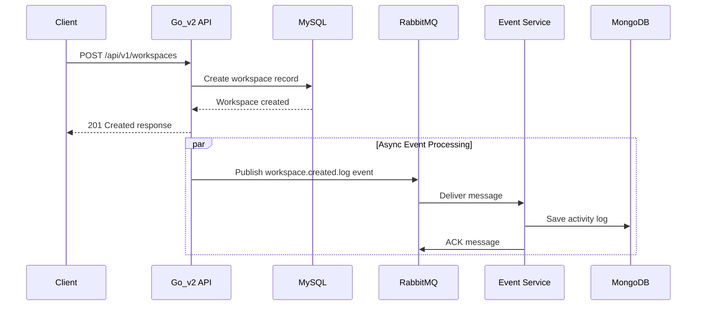
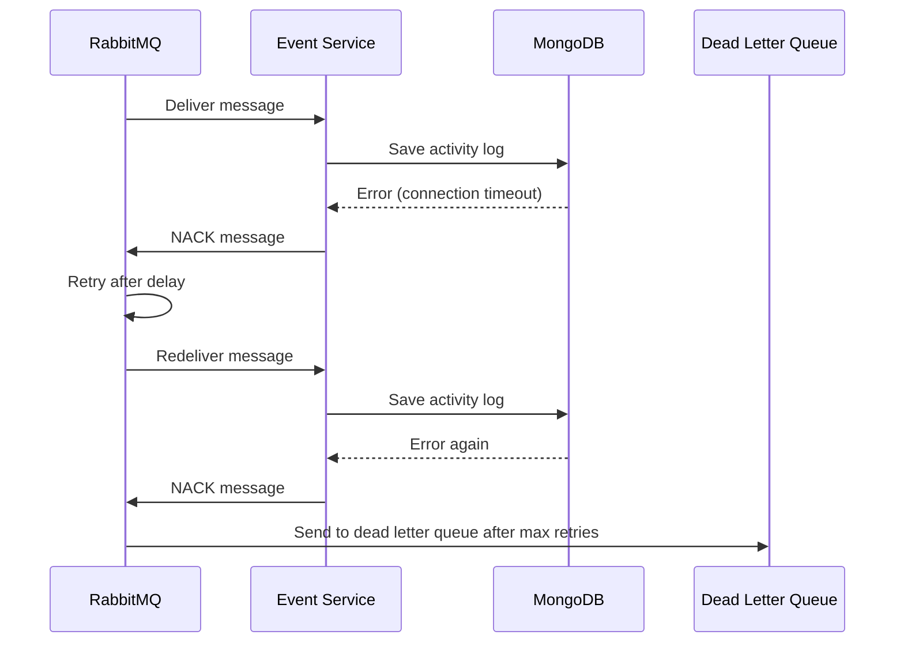
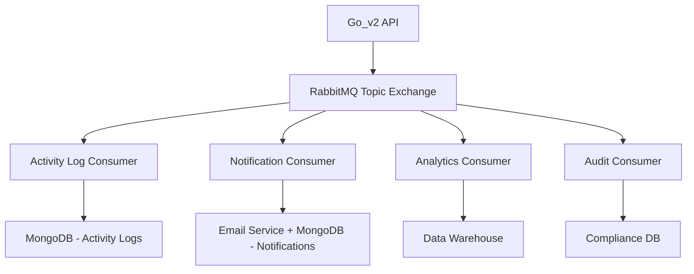

# Activity Log System Design

## 1. Overview

Hệ thống ghi log hoạt động (Activity Log System) được thiết kế để theo dõi và ghi lại tất cả các thao tác Create, Update, Delete (CUD) trong hệ thống một cách bất đồng bộ và có khả năng mở rộng cao.

### 1.1 Mục tiêu chính
- **Audit Trail**: Ghi lại chi tiết ai đã làm gì, khi nào, trên đối tượng nào
- **Debugging**: Cung cấp thông tin để truy vết lỗi và phân tích luồng hoạt động
- **Scalability**: Có khả năng mở rộng để xử lý nhiều loại sự kiện khác nhau trong tương lai
- **Performance**: Không ảnh hưởng đến hiệu năng của API chính

### 1.2 Kiến trúc tổng quan
```
┌─────────────────┐    Events     ┌─────────────────┐    Messages    ┌─────────────────┐
│   Go_v2 API     │ ──────────────▶│   RabbitMQ      │ ──────────────▶│  Event Service  │
│   (Producer)    │               │ (Message Broker) │               │   (Consumer)    │
└─────────────────┘               └─────────────────┘               └─────────────────┘
        │                                                                      │
        │                                                                      │
        ▼                                                                      ▼
┌─────────────────┐                                                  ┌─────────────────┐
│   MySQL DB      │                                                  │   MongoDB       │
│ (Business Data) │                                                  │ (Activity Logs) │
└─────────────────┘                                                  └─────────────────┘
```

## 2. Kiến trúc Chi tiết

### 2.1 Event-Driven Architecture

Hệ thống sử dụng mô hình **Event-Driven Architecture** với **Topic Exchange** pattern:

#### 2.1.1 Publisher (Go_v2 Service)
- **Vai trò**: Phát sinh và gửi sự kiện khi có thao tác CUD
- **Công nghệ**: Go với RabbitMQ AMQP client
- **Đặc điểm**: Fire-and-forget, không chờ phản hồi từ consumer

#### 2.1.2 Message Broker (RabbitMQ)
- **Exchange Type**: Topic Exchange
- **Exchange Name**: `iam_events_topic`
- **Routing Pattern**: `{resource}.{action}.{feature}` (ví dụ: `workspace.created.log`, `user.updated.log`)
- **Durability**: Persistent messages để đảm bảo không mất dữ liệu

#### 2.1.3 Consumer (Event Service)
- **Vai trò**: Lắng nghe, xử lý và lưu trữ sự kiện
- **Công nghệ**: Go với MongoDB
- **Binding Pattern**: `#.log` (nhận tất cả sự kiện)

### 2.2 Cấu trúc Sự kiện (Event Structure)

#### 2.2.1 Generic Event Envelope
```json
{
  "eventId": "uuid-string",
  "topic": "workspace.created.log",
  "sourceService": "go_v2_api",
  "userId": 12345,
  "timestamp": "2024-01-15T10:30:00Z",
  "payload": {
    // Dữ liệu nghiệp vụ cụ thể
  }
}
```

#### 2.2.2 Event Payload Examples
```json
// Workspace Created Event
{
  "workspaceId": 100,
  "workspaceName": "My New Workspace",
  "createdById": 12345
}

// User Updated Event
{
  "userId": 12345,
  "updatedFields": ["email", "name"],
  "updatedById": 12345
}

// User Deleted Event
{
  "userId": 12345,
  "deletedById": 12345
}
```

## 3. Thành phần Hệ thống

### 3.1 Go_v2 Service (Producer)

#### 3.1.1 Cấu trúc thư mục
```
internal/
├── dto/
│   └── event_dto.go              # Định nghĩa cấu trúc sự kiện
├── initialize/
│   └── rabbitmq.go              # Khởi tạo RabbitMQ connection
└── common/
    └── event_constants.go        # Định nghĩa các topic constants

pkg/
└── utils/
    ├── event_publisher_interface.go # EventPublisher interface
    └── event_publisher_service.go   # RabbitMQ implementation
```

#### 3.1.2 Key Components

**EventPublisher Interface** (trong `pkg/utils/event_publisher_interface.go`)
```go
type EventPublisher interface {
    Publish(ctx context.Context, topic string, payload interface{}) error
}
```

**RabbitMQ Publisher Implementation** (trong `pkg/utils/event_publisher_service.go`)
- Kết nối đến RabbitMQ Topic Exchange `iam_events_topic`
- Serialize sự kiện thành JSON
- Publish với DeliveryMode = Persistent
- Error handling và logging

**Service Integration**
- Tích hợp vào các service nghiệp vụ (workspace_service, user_service, etc.)
- Gọi EventPublisher.Publish() sau khi thao tác CUD thành công
- Chạy trong goroutine riêng để không block API response

#### 3.1.3 Event Topics
```go
const (
    // Workspace Events
    WorkspaceCreatedLog = "workspace.created.log"
    WorkspaceUpdatedLog = "workspace.updated.log"
    WorkspaceDeletedLog = "workspace.deleted.log"
    
    // User Events
    UserCreatedLog = "user.created.log"
    UserUpdatedLog = "user.updated.log"
    UserDeletedLog = "user.deleted.log"
    
    // Member Events
    MemberAddedLog   = "member.added.log"
    MemberRemovedLog = "member.removed.log"
    MemberRoleChangedLog = "member.role_changed.log"
)
```

### 3.2 Event Service (Consumer)

#### 3.2.1 Cấu trúc dự kiến
```
event_service/
├── cmd/
│   └── server/
│       └── main.go              # Entry point - khởi tạo config, logger, DB, và consumers
├── configs/
│   ├── local.yaml               # Cấu hình cho môi trường local (MongoDB, RabbitMQ)
│   └── docker-compose.yaml      # Cấu hình Docker để chạy cùng với các service khác
├── internal/
│   ├── common/                  # Các hằng số, định nghĩa lỗi chung
│   │   ├── consumer_constants.go # Constants cho consumer (queue names, routing keys)
│   │   └── errors.go            # Centralized error definitions
│   ├── consumers/               # (Tương đương với controllers trong API)
│   │   ├── interface.go         # Interface cho các consumer
│   │   ├── activity_log_consumer.go # Logic để nhận và xử lý message từ RabbitMQ
│   │   └── notification_consumer.go # (Ví dụ consumer mở rộng trong tương lai)
│   ├── dto/
│   │   └── event_dto.go         # Data Transfer Objects, định nghĩa cấu trúc của các event
│   ├── initialize/
│   │   ├── loadconfig.go        # Tải cấu hình từ file .yaml
│   │   ├── logger.go            # Khởi tạo logger
│   │   ├── mongodb.go           # Khởi tạo kết nối tới MongoDB
│   │   ├── rabbitmq.go          # Khởi tạo kết nối tới RabbitMQ
│   │   ├── consumer.go          # Khởi tạo và đăng ký các consumer
│   │   └── run.go               # Orchestrate tất cả các init functions
│   ├── models/
│   │   ├── activity_log.go      # Định nghĩa struct cho collection `activity_logs` trong MongoDB
│   │   └── notification.go      # (Ví dụ model mở rộng trong tương lai)
│   ├── repo/
│   │   ├── interface.go         # Interface cho repository
│   │   ├── activity_log_repository.go # Logic truy vấn database (MongoDB)
│   │   └── notification_repository.go # (Ví dụ repo mở rộng trong tương lai)
│   └── services/
│       ├── interface.go         # Interface cho service
│       ├── log_service.go       # Business logic: xử lý dữ liệu từ event và gọi repo để lưu trữ
│       └── notification_service.go # (Ví dụ service mở rộng trong tương lai)
├── pkg/                         # Các package có thể chia sẻ
│   ├── logger/                  # Logger utilities
│   ├── setting/                 # Configuration management
│   │   └── section.go           # Config structs
│   └── utils/                   # Shared utilities
├── global/
│   └── global.go                # Global variables (DB connections, config, etc.)
├── go.mod                       # Quản lý dependencies
├── go.sum
├── Dockerfile                   # Để build service thành một container
└── README.md                    # Documentation cho event service
```

#### 3.2.2 Luồng xử lý trong Event Service
```
RabbitMQ Message → ActivityLogConsumer → LogService → ActivityLogRepository → MongoDB
```

**Chi tiết luồng:**
1. **Consumer Layer** (`internal/consumers/activity_log_consumer.go`):
   - Lắng nghe messages từ RabbitMQ queue
   - Deserialize JSON message thành Event DTO
   - Gọi Service layer để xử lý business logic
   - Acknowledge message sau khi xử lý thành công

2. **Service Layer** (`internal/services/log_service.go`):
   - Nhận Event DTO từ Consumer
   - Validate và transform dữ liệu
   - Tạo ActivityLog model
   - Gọi Repository để lưu trữ

3. **Repository Layer** (`internal/repo/activity_log_repository.go`):
   - Thực hiện operations với MongoDB
   - Handle database errors
   - Return results về Service layer

#### 3.2.3 MongoDB Document Structure
```javascript
// Activity Log Collection
{
  "_id": ObjectId("..."),
  "eventId": "uuid-string",
  "topic": "workspace.created.log",
  "sourceService": "go_v2_api",
  "userId": 12345,
  "timestamp": ISODate("2024-01-15T10:30:00Z"),
  "payload": {
    "workspaceId": 100,
    "workspaceName": "My New Workspace",
    "createdById": 12345
  },
  "processedAt": ISODate("2024-01-15T10:30:01Z"),
  "version": 1
}
```

#### 3.2.4 Key Features
- **Message Acknowledgment**: Sử dụng manual ack để đảm bảo message được xử lý thành công
- **Error Handling**: Dead letter queue cho các message lỗi
- **Retry Logic**: Retry với exponential backoff
- **Graceful Shutdown**: Xử lý shutdown signal để đảm bảo không mất message
- **Modular Design**: Dễ dàng thêm consumer mới cho các loại event khác
- **Clean Architecture**: Tách biệt rõ ràng giữa consumer, service, và repository layers

## 4. Luồng hoạt động (Flow)

### 4.1 Luồng tạo Workspace


### 4.2 Luồng xử lý lỗi


## 5. Cấu hình và Deployment

### 5.1 RabbitMQ Configuration
```yaml
# Go_v2 Service
rabbitmq:
  host: "localhost"
  port: 5672
  user: "guest"
  password: "guest"
  iam_exchange: "iam_events_topic"

# Event Service
rabbitmq:
  host: "localhost"
  port: 5672
  user: "guest"
  password: "guest"
  iam_exchange: "iam_events_topic"
  activity_log_queue: "iam_activity_log_queue"
  bindingKey: "#.log"  # Chỉ nhận sự kiện log
```

### 5.2 MongoDB Configuration
```yaml
mongodb:
  host: "localhost"
  port: 27017
  database: "Notification"
  collection: "logs"
  user: "admin"
  password: "password"
```

### 5.3 Docker Compose
```yaml
version: '3.8'
services:
  rabbitmq:
    image: rabbitmq:3-management
    ports:
      - "5672:5672"
      - "15672:15672"
    environment:
      RABBITMQ_DEFAULT_USER: guest
      RABBITMQ_DEFAULT_PASS: guest

  mongodb:
    image: mongo:6.0
    ports:
      - "27017:27017"
    environment:
      MONGO_INITDB_ROOT_USERNAME: admin
      MONGO_INITDB_ROOT_PASSWORD: password

  go-api:
    build: ./Go_v2
    ports:
      - "8080:8080"
    depends_on:
      - rabbitmq
      - mysql

  event-service:
    build: ./Event
    depends_on:
      - rabbitmq
      - mongodb
```

## 6. Khả năng mở rộng

### 6.1 Thêm Consumer mới
Hệ thống được thiết kế để dễ dàng thêm các consumer mới với cấu trúc modular:



**Cấu trúc thư mục khi có nhiều consumer:**
```
event_service/
├── internal/
│   ├── consumers/
│   │   ├── interface.go                    # Common consumer interface
│   │   ├── activity_log_consumer.go        # Consumer cho activity logs
│   │   ├── notification_consumer.go        # Consumer cho notifications
│   │   ├── analytics_consumer.go           # Consumer cho analytics
│   │   └── audit_consumer.go               # Consumer cho audit trail
│   ├── services/
│   │   ├── interface.go                    # Common service interface
│   │   ├── log_service.go                  # Business logic cho activity logs
│   │   ├── notification_service.go         # Business logic cho notifications
│   │   ├── analytics_service.go            # Business logic cho analytics
│   │   └── audit_service.go                # Business logic cho audit
│   ├── repo/
│   │   ├── interface.go                    # Common repository interface
│   │   ├── activity_log_repository.go      # MongoDB operations cho logs
│   │   ├── notification_repository.go      # MongoDB operations cho notifications
│   │   ├── analytics_repository.go         # Data warehouse operations
│   │   └── audit_repository.go             # Compliance DB operations
│   └── models/
│       ├── activity_log.go                 # Activity log model
│       ├── notification.go                 # Notification model
│       ├── analytics_event.go              # Analytics event model
│       └── audit_record.go                 # Audit record model
...
```

**Cách thêm consumer mới:**
1. Tạo consumer mới trong `internal/consumers/new_consumer.go`
2. Implement service logic trong `internal/services/new_service.go`
3. Implement repository trong `internal/repo/new_repository.go`
4. Đăng ký consumer trong `internal/initialize/consumer.go`

### 6.2 Event Types mở rộng
- **Authentication Events**: `auth.login.log`, `auth.logout.log`, `auth.failed.log`
- **Permission Events**: `permission.granted.log`, `permission.revoked.log`
- **System Events**: `system.backup.log`, `system.maintenance.log`
- **Integration Events**: `integration.connected.log`, `integration.failed.log`
- **Notification Events**: `user.created.notification`, `workspace.created.notification`
- **Analytics Events**: `user.activity.analytics`, `workspace.usage.analytics`

### 6.3 Filtering và Routing
Sử dụng Topic Exchange pattern cho phép filtering linh hoạt:
- `*.created.log` - Chỉ nhận sự kiện tạo mới để ghi log
- `workspace.*.log` - Chỉ nhận sự kiện workspace để ghi log
- `user.updated.log` - Chỉ nhận sự kiện cập nhật user để ghi log
- `*.*.log` - Nhận tất cả sự kiện log
- `*.*.notification` - Nhận tất cả sự kiện notification
- `*.*.analytics` - Nhận tất cả sự kiện analytics
  - `#` - Nhận tất cả sự kiện (tất cả features)

## 7. Implementation Plan

### Phase 1: Cơ sở hạ tầng và Cấu hình (Infrastructure & Configuration)

#### 7.1 Cài đặt Dependencies
- [x] Cài đặt RabbitMQ client cho Go: `go get github.com/rabbitmq/amqp091-go`
- [x] Cài đặt UUID generator: `go get github.com/google/uuid`
- [x] Cập nhật `go.mod` và `go.sum`

#### 7.2 Cấu hình RabbitMQ
- [x] Cập nhật `configs/local.yaml` với RabbitMQ configuration
- [x] Cập nhật `pkg/setting/section.go` với RabbitMQ struct
- [x] Thêm RabbitMQ vào `global/global.go`
- [x] Tạo `internal/initialize/rabbitmq.go` để khởi tạo connection

#### 7.3 Docker Compose Setup
- [x] Thêm RabbitMQ service vào `docker-compose.yaml`
- [x] Cấu hình RabbitMQ Management UI
- [x] Test kết nối RabbitMQ

### Phase 2: Event Publisher Implementation (Go_v2 Service)

#### 7.4 Event DTOs và Constants
- [x] Tạo `internal/dto/event_dto.go` với GenericEvent struct
- [x] Tạo `internal/common/event_constants.go` với topic constants
- [x] Tạo payload DTOs cho từng loại event (WorkspaceCreatedPayload, UserUpdatedPayload, etc.)

#### 7.5 Event Publisher Service
- [x] Tạo `pkg/utils/event_publisher_service.go` với RabbitMQ implementation
- [x] Implement `NewRabbitMQPublisher()` constructor
- [x] Implement `Publish()` method với JSON serialization

#### 7.6 Integration Setup
- [x] Cập nhật `internal/initialize/run.go` để gọi `InitRabbitMQ()`
- [x] Test connection và exchange declaration
- [x] Implement error handling và logging

### Phase 3: Service Integration (Business Logic)

#### 7.7 Workspace Service Integration
- [x] Tích hợp event publishing vào `CreateWorkspace()` method


### Phase 4: Event Service Implementation (Consumer)

#### 7.10 Event Service Project Setup
- [x] Tạo project structure cho Event service theo Clean Architecture
- [x] Setup `go.mod` cho Event service
- [x] Tạo `cmd/server/main.go` entry point
- [x] Setup `pkg/setting/section.go` cho configuration management
- [x] Tạo `global/global.go` cho global variables
- [x] Tạo `internal/common/` cho constants và errors

#### 7.11 Configuration và Initialization
- [x] Tạo `configs/local.yaml` với MongoDB và RabbitMQ config
- [x] Tạo `internal/initialize/loadconfig.go` 
- [x] Tạo `internal/initialize/mongodb.go`
- [x] Tạo `internal/initialize/rabbitmq.go`
- [x] Tạo `internal/initialize/run.go` để orchestrate tất cả

#### 7.12 MongoDB Integration
- [x] Cài đặt MongoDB driver: `go get go.mongodb.org/mongo-driver/mongo`
- [x] Implement MongoDB connection trong `internal/initialize/mongodb.go`
- [x] Tạo `internal/models/activity_log.go` document model
- [x] Tạo `internal/repo/interface.go` cho repository interfaces
- [x] Tạo `internal/repo/activity_log_repository.go`

#### 7.13 Service Layer Implementation
- [x] Tạo `internal/services/interface.go` cho service interfaces
- [x] Tạo `internal/services/log_service.go` với business logic
- [x] Implement event validation và transformation logic
- [x] Implement error handling và logging

#### 7.14 Consumer Layer Implementation
- [x] Tạo `internal/consumers/interface.go` cho consumer interfaces
- [x] Tạo `internal/consumers/activity_log_consumer.go`
- [x] Implement message consumption logic với manual acknowledgment
- [x] Implement error handling và retry logic
- [x] Implement graceful shutdown handling
