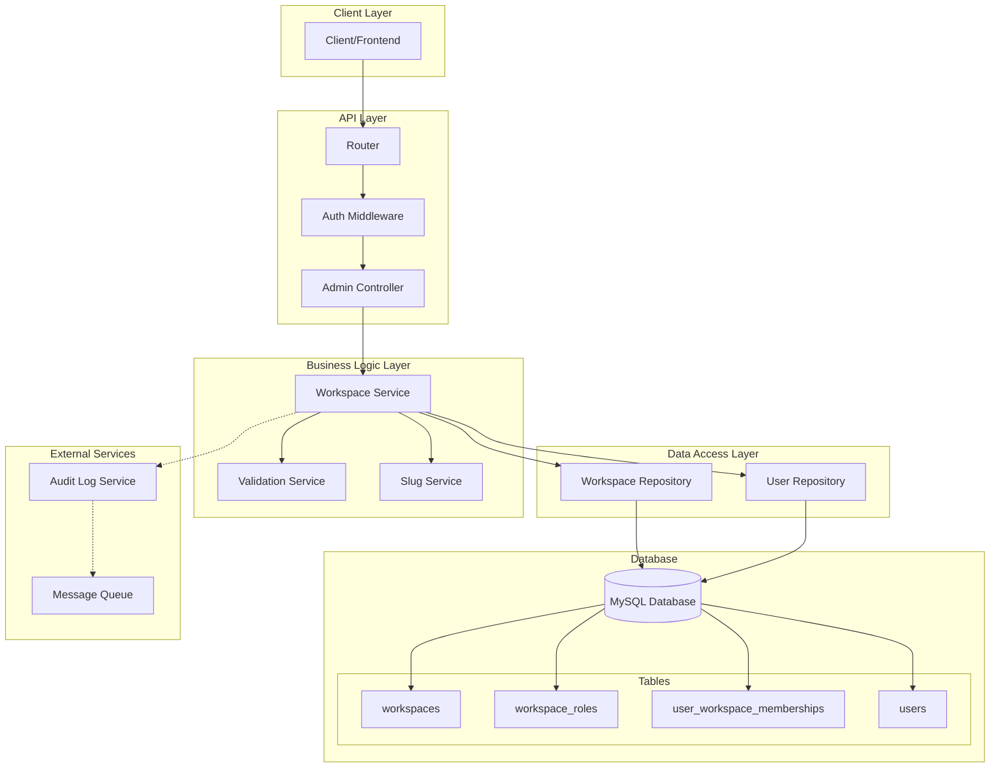
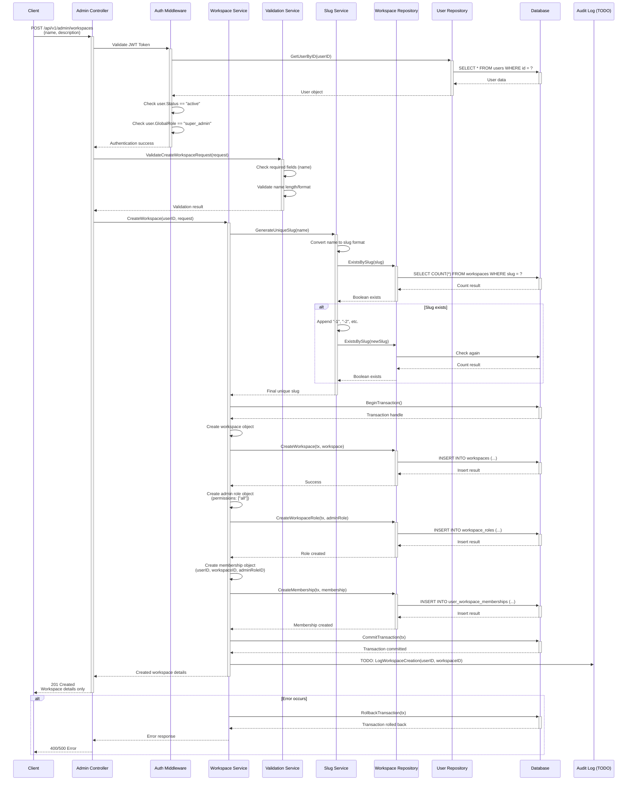
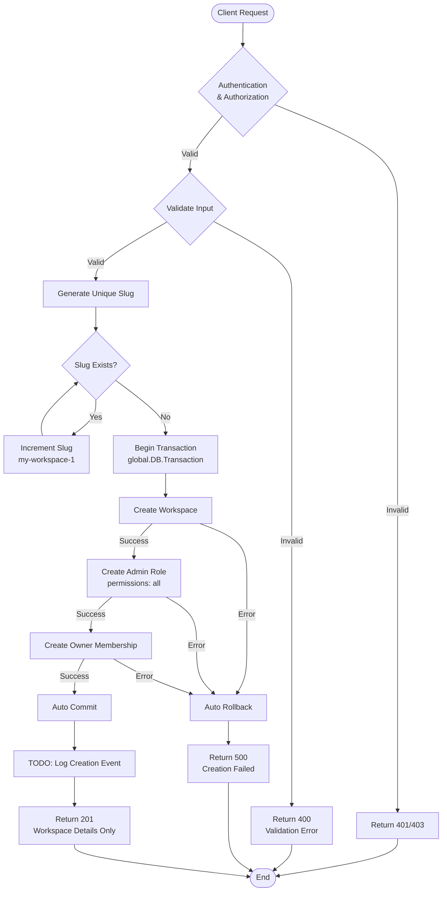
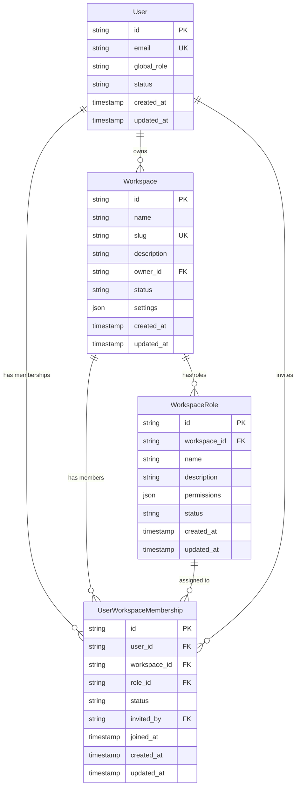

# System Design: Create Workspace Feature

## Overview
This document outlines the system design for the workspace creation feature in our Go backend application. The feature allows super_admin users to create new multi-tenant workspaces with automatic role and membership setup.

## Core Requirements
- Only authenticated users with `globalRole = super_admin` can create workspaces
- User status must be `active`
- Workspace slug is auto-generated from workspace name
- Handle slug conflicts by appending incremental numbers
- Automatically create admin role with full permissions
- Add workspace owner as admin member
- Use database transactions for data consistency
- Log workspace creation events (TODO: implement audit service)

## System Architecture



## Sequence Diagram



## Data Flow Diagram



## Entity Relationship Diagram



## API Contract

### Request
```http
POST /api/v1/admin/workspaces
Authorization: Bearer <jwt_token>
Content-Type: application/json

{
  "name": "My Awesome Workspace",
  "description": "Description of the workspace (optional)"
}
```

### Success Response (201 Created)
```json
{
  "message": "Workspace created successfully",
  "data": {
    "id": "ws_1234567890",
    "name": "My Awesome Workspace",
    "slug": "my-awesome-workspace",
    "description": "Description of the workspace",
    "owner_id": "user_1234567890",
    "status": "active",
    "created_at": "2024-01-15T10:30:00Z",
    "updated_at": "2024-01-15T10:30:00Z"
  },
  "meta": {
    "timestamp": "2024-01-15T10:30:00Z",
    "path": "/api/v1/admin/workspaces"
  }
}
```

### Error Responses

#### 401 Unauthorized
```json
{
  "error": "Unauthorized",
  "code": "UNAUTHORIZED",
  "message": "Invalid or missing authentication token",
  "path": "/api/v1/admin/workspaces"
}
```

#### 403 Forbidden
```json
{
  "error": "Forbidden",
  "code": "WORKSPACE_CREATE_FORBIDDEN",
  "message": "Only super admin users can create workspaces",
  "path": "/api/v1/admin/workspaces"
}
```

#### 400 Bad Request
```json
{
  "error": "Bad Request",
  "code": "VALIDATION_FAILED",
  "message": "Workspace name is required",
  "path": "/api/v1/admin/workspaces",
  "details": {
    "field": "name",
    "error": "required"
  }
}
```

#### 500 Internal Server Error
```json
{
  "error": "Internal Server Error",
  "code": "WORKSPACE_CREATE_FAILED",
  "message": "Failed to create workspace",
  "path": "/api/v1/admin/workspaces"
}
```

## Security Considerations

1. **Authentication**: JWT token validation
2. **Authorization**: Super admin role requirement
3. **Input Validation**: Sanitize workspace name and description
4. **SQL Injection**: Use parameterized queries
5. **Transaction Safety**: Atomic operations for data consistency
6. **Rate Limiting**: Prevent workspace creation spam
7. **Audit Logging**: Track workspace creation for compliance

## Step-by-Step Implementation Guide

### Phase 1: Foundation Setup

#### [ ] Step 1: Add Error Constants
Create workspace-related error constants in `internal/common/httpError.go`:
```go
// Workspace creation errors
ErrWorkspaceCreateForbidden = &APIError{
    Status: http.StatusForbidden, 
    Code: "WORKSPACE_CREATE_FORBIDDEN", 
    Message: "Only super admin users can create workspaces"
}
ErrWorkspaceNameRequired = &APIError{
    Status: http.StatusBadRequest, 
    Code: "WORKSPACE_NAME_REQUIRED", 
    Message: "Workspace name is required"
}
ErrWorkspaceCreateFailed = &APIError{
    Status: http.StatusInternalServerError, 
    Code: "WORKSPACE_CREATE_FAILED", 
    Message: "Failed to create workspace"
}
ErrWorkspaceSlugGeneration = &APIError{
    Status: http.StatusInternalServerError, 
    Code: "WORKSPACE_SLUG_GENERATION_FAILED", 
    Message: "Failed to generate unique workspace slug"
}
```

#### [ ] Step 2: Create Workspace DTO
Create `internal/dto/workspace_dto.go`:
```go
type CreateWorkspaceRequest struct {
    Name        string `json:"name" validate:"required,min=1,max=255"`
    Description string `json:"description,omitempty" validate:"max=1000"`
}

type WorkspaceResponse struct {
    ID          string    `json:"id"`
    Name        string    `json:"name"`
    Slug        string    `json:"slug"`
    Description string    `json:"description,omitempty"`
    OwnerID     string    `json:"owner_id"`
    Status      string    `json:"status"`
    CreatedAt   time.Time `json:"created_at"`
    UpdatedAt   time.Time `json:"updated_at"`
}
```

### Phase 2: Repository Layer

#### [ ] Step 3: Implement Workspace Repository
Create `internal/repo/workspace_repository.go` implementing `WorkspaceRepositoryInterface`:
```go
type WorkspaceRepository struct {
    db *gorm.DB
}

func NewWorkspaceRepository() WorkspaceRepositoryInterface {
    return &WorkspaceRepository{db: global.DB}
}

// Implement all methods from WorkspaceRepositoryInterface
func (r *WorkspaceRepository) CreateWorkspace(tx *gorm.DB, workspace *models.Workspace) error
func (r *WorkspaceRepository) ExistsBySlug(slug string) (bool, error)
func (r *WorkspaceRepository) CreateWorkspaceRole(tx *gorm.DB, role *models.WorkspaceRole) error
func (r *WorkspaceRepository) CreateMembership(tx *gorm.DB, membership *models.UserWorkspaceMembership) error
// ... other methods
```

#### [ ] Step 4: Add Slug Generation Utility
Create `pkg/utils/slug.go`:
```go
func GenerateSlug(name string) string {
    // Convert to lowercase, replace spaces with hyphens, remove special chars
}

func GenerateUniqueSlug(name string, checkExists func(string) (bool, error)) (string, error) {
    // Generate base slug and handle conflicts with incremental numbers
}
```

### Phase 3: Service Layer

#### [ ] Step 5: Create Workspace Service
Create `internal/services/workspace_service.go`:
```go
type WorkspaceService struct {
    workspaceRepo WorkspaceRepositoryInterface
    userRepo      UserRepositoryInterface
}

func NewWorkspaceService() *WorkspaceService {
    return &WorkspaceService{
        workspaceRepo: repo.NewWorkspaceRepository(),
        userRepo:      repo.NewUserRepository(),
    }
}

func (s *WorkspaceService) CreateWorkspace(userID string, req *dto.CreateWorkspaceRequest) (*dto.WorkspaceResponse, error) {
    // Implementation with transaction
}
```

#### [ ] Step 6: Implement CreateWorkspace Method
Add the main business logic in workspace service:
- Generate unique slug
- Create workspace, admin role, and membership in transaction
- Return workspace response

### Phase 4: Controller Layer

#### [ ] Step 7: Create Admin Controller
Create `internal/controllers/admin_controller.go`:
```go
type AdminController struct {
    workspaceService services.WorkspaceServiceInterface
    validator        *validator.Validate
}

func NewAdminController(workspaceService services.WorkspaceServiceInterface) *AdminController {
    v := validator.New()
    utils.SetupCustomValidators(v)
    
    return &AdminController{
        workspaceService: workspaceService,
        validator:        v,
    }
}

func (c *AdminController) CreateWorkspace(ctx *fiber.Ctx) error {
    // 1. Get user from context (from auth middleware)
    // 2. Validate request body
    // 3. Call workspace service
    // 4. Return response
}
```

#### [ ] Step 8: Add Combined Authentication & Authorization Middleware
Update `internal/middlewares/auth_middleware.go` to handle both auth and super admin check:
```go
func RequireSuperAdmin(authService services.AuthServiceInterface) fiber.Handler {
    return func(ctx *fiber.Ctx) error {
        // 1. Extract and validate JWT token
        token := ctx.Cookies(common.JWTCookieName)
        if token == "" {
            return common.ErrTokenRequired
        }

        userID, err := authService.ValidateToken(token)
        if err != nil {
            return common.ErrTokenInvalid
        }

        // 2. Get user details to check role and status
        userRepo := repo.NewUserRepository()
        user, err := userRepo.GetUserByID(userID)
        if err != nil || user == nil {
            return common.ErrUserNotFound
        }

        // 3. Check if user status is active
        if user.Status != common.UserStatusActive {
            return common.ErrUserInactive
        }

        // 4. Check if user has super_admin role
        if user.GlobalRole != common.GlobalRoleSuperAdmin {
            return common.ErrWorkspaceCreateForbidden
        }

        // 5. Set userID in context for controller use
        ctx.Locals(common.ContextUserID, userID)
        return ctx.Next()
    }
}
```

### Phase 5: Routing Setup

#### [ ] Step 9: Create Admin Routes
Create `internal/router/routes/admin_routes.go`:
```go
type AdminRoutes struct {
    adminController *controllers.AdminController
}

func NewAdminRoutes() *AdminRoutes {
    return &AdminRoutes{
        adminController: controllers.NewAdminController(
            services.NewWorkspaceService(
                repo.NewWorkspaceRepository(),
                repo.NewUserRepository(),
            ),
        ),
    }
}

func (r *AdminRoutes) GetPrefix() string {
    return "/admin"
}

func (r *AdminRoutes) SetupRoutes(router fiber.Router) {
    group := router.Group(r.GetPrefix())
    
    // Apply combined authentication and super admin authorization for all admin routes
    group.Use(middlewares.RequireSuperAdmin(services.NewAuthService()))
    
    // Nested resource routes
    group.Post("/workspaces", r.adminController.CreateWorkspace)
}
```

#### [ ] Step 10: Register Admin Routes
Update `internal/router/router.go` to include admin routes:
```go
routeModules := []routes.RouteModule{
    routes.NewPublicRoutes(),
    routes.NewAuthRoutes(),
    routes.NewUserRoutes(),
    routes.NewAdminRoutes(), // Add this line for super admin operations
}
```

### Phase 6: Testing

#### [ ] Step 11: Write Unit Tests for Utilities
Create `test/utils/slug_test.go`:
- Test slug generation from various inputs
- Test unique slug generation with conflicts

#### [ ] Step 12: Write Repository Tests
Create `test/repo/workspace_repository_test.go`:
- Test workspace creation
- Test slug existence check
- Test role and membership creation

#### [ ] Step 13: Write Service Tests
Create `test/services/workspace_service_test.go`:
- Test successful workspace creation
- Test validation errors
- Test authorization errors
- Test transaction rollback scenarios

#### [ ] Step 14: Write Controller Tests
Create `test/controllers/admin_controller_test.go`:
- Test HTTP endpoints
- Test request/response format
- Test middleware integration

#### [ ] Step 15: Write Integration Tests
Create `test/integration/workspace_test.go`:
- Test complete workflow from API call to database
- Test with real database transactions

