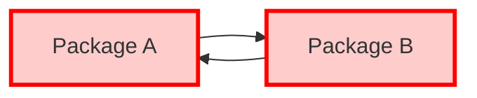
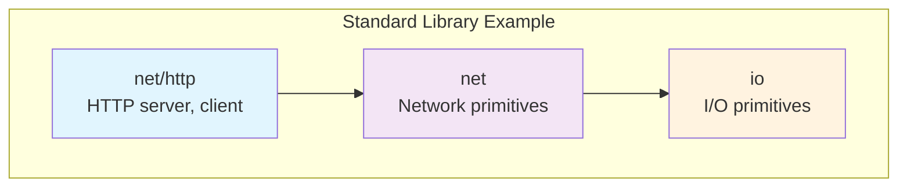
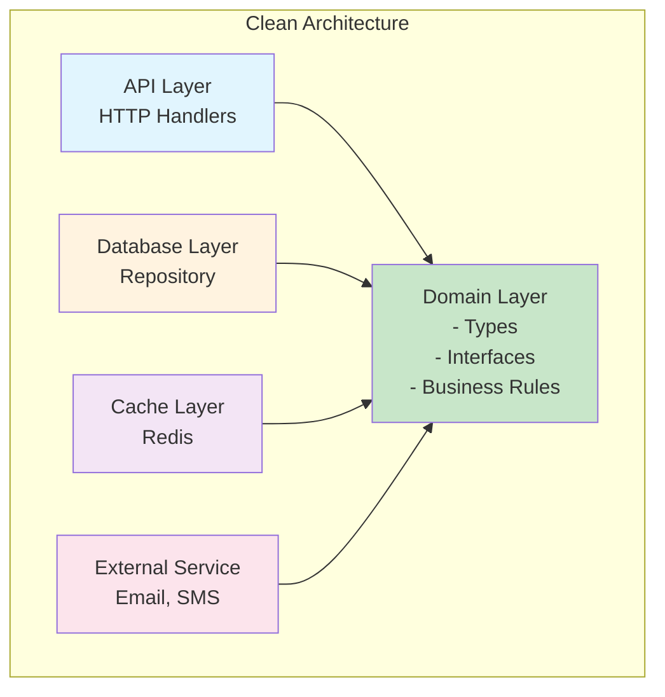
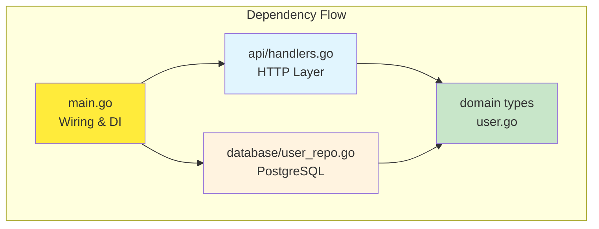
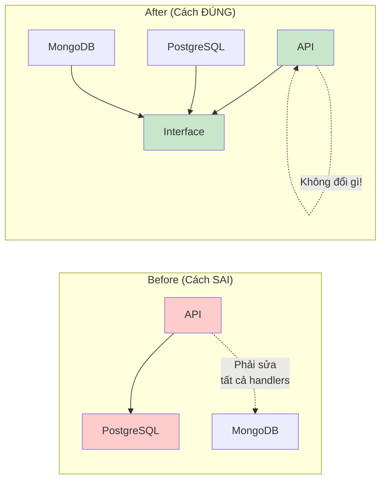
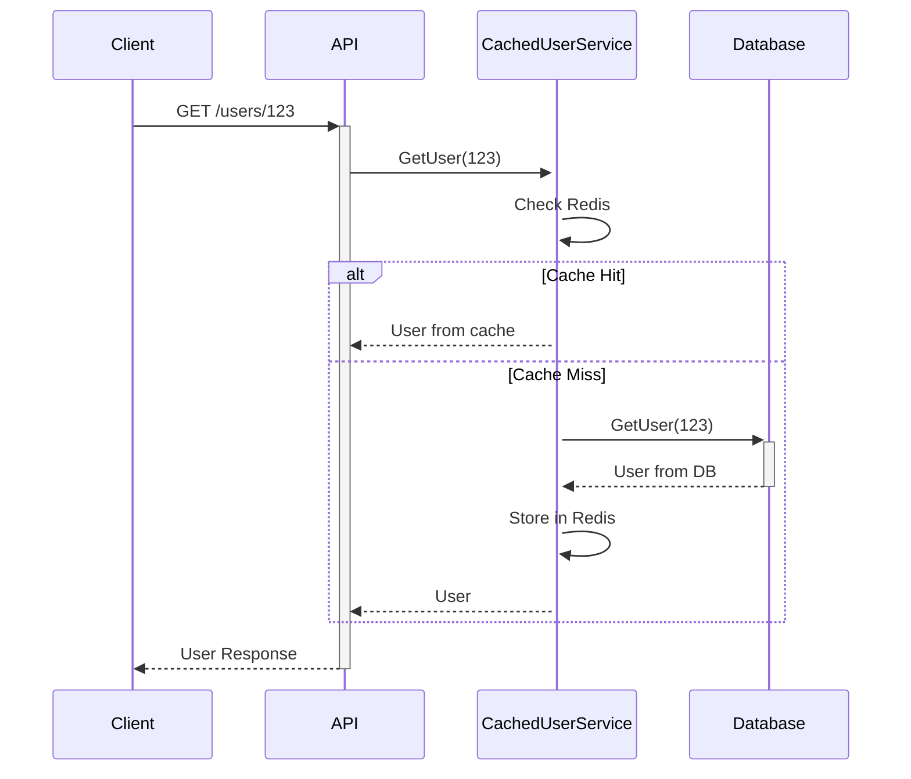
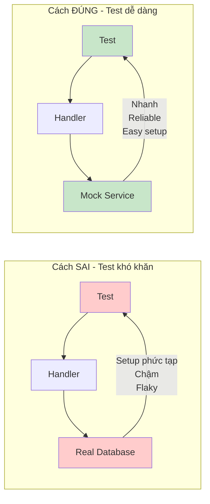
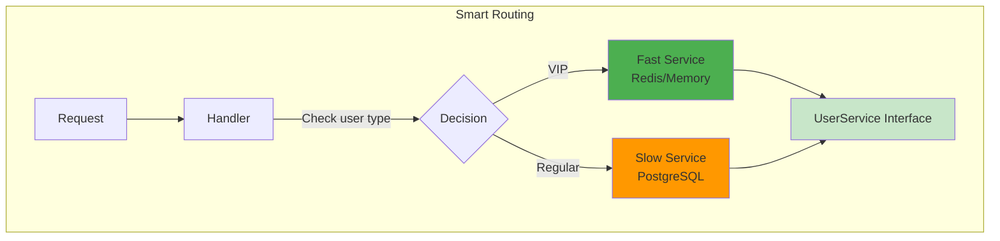
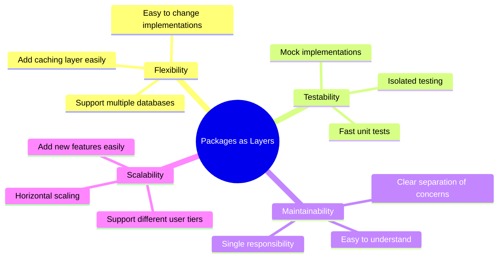

# Go Packages as Layers - Hướng dẫn toàn diện

## Mục lục
1. [Vấn đề cơ bản](#vấn-đề-cơ-bản)
2. [Tại sao Go packages khác biệt](#tại-sao-go-packages-khác-biệt)
3. [Giải pháp: Packages as Layers](#giải-pháp-packages-as-layers)
4. [Ví dụ thực tế](#ví-dụ-thực-tế)
5. [Lợi ích trong các tình huống thực tế](#lợi-ích-trong-các-tình-huống-thực-tế)

---

## Vấn đề cơ bản

### Go không cho phép Circular Dependencies

Khác với các ngôn ngữ khác, Go **nghiêm cấm** dependency loop giữa các packages.



**❌ Điều này sẽ gây lỗi compile trong Go**

### Vấn đề thường gặp

Nhiều developer mới học Go thường tổ chức code theo kiểu "grouping":

```mermaid
graph TD
    subgraph "Cách tổ chức SAI"
        A[user package<br/>- User struct<br/>- CreateUser()<br/>- GetUser()]
        B[product package<br/>- Product struct<br/>- CreateProduct()<br/>- GetProduct()]
        C[order package<br/>- Order struct<br/>- CreateOrder()<br/>- GetOrder()]
        
        A -.-> B
        B -.-> C
        C -.-> A
    end
    
    style A fill:#ffcccc
    style B fill:#ffcccc  
    style C fill:#ffcccc
```

**Kết quả:** Import cycle error!

---

## Tại sao Go packages khác biệt

### So sánh với ngôn ngữ khác

| Ngôn ngữ | Cách tổ chức | Cho phép circular? |
|----------|--------------|-------------------|
| Java | Packages = Groups | ✅ Yes |
| Ruby | Gems = Groups | ✅ Yes |
| Go | **Packages = Layers** | ❌ No |

### Triết lý của Go

Go packages được thiết kế như **layers của kiến trúc**, không phải groups của functionality.



---

## Giải pháp: Packages as Layers

### Nguyên tắc cơ bản

**Tất cả packages nên depend vào một "domain layer" chung**



### Cấu trúc thư mục đề xuất

```
project/
├── main.go              # Entry point
├── user.go             # Domain: User type + UserService interface
├── product.go          # Domain: Product type + ProductService interface
├── database/           # Implementation layer
│   ├── user_repo.go    # Implement UserService
│   └── product_repo.go # Implement ProductService
├── api/                # Transport layer  
│   └── handlers.go     # HTTP handlers
└── cache/              # Another implementation layer
    └── redis_cache.go  # Cached implementations
```

---

## Ví dụ thực tế

### Bước 1: Domain Layer (Types + Interfaces)

```go
// user.go - Domain layer
package myapp

import "context"

// Domain type
type User struct {
    ID    int    `json:"id"`
    Name  string `json:"name"`
    Email string `json:"email"`
}

// Service interface - ĐÂY LÀ ĐIỂM QUAN TRỌNG!
type UserService interface {
    CreateUser(ctx context.Context, user *User) error
    GetUser(ctx context.Context, id int) (*User, error)
    UpdateUser(ctx context.Context, id int, updates *User) error
    DeleteUser(ctx context.Context, id int) error
}
```

### Bước 2: Implementation Layer

```go
// database/user_repo.go
package database

import (
    "context"
    "myapp" // Import domain
)

type UserRepository struct {
    db *sql.DB
}

// Implement UserService interface
func (r *UserRepository) CreateUser(ctx context.Context, user *myapp.User) error {
    query := "INSERT INTO users (name, email) VALUES ($1, $2) RETURNING id"
    err := r.db.QueryRowContext(ctx, query, user.Name, user.Email).Scan(&user.ID)
    return err
}

func (r *UserRepository) GetUser(ctx context.Context, id int) (*myapp.User, error) {
    user := &myapp.User{}
    query := "SELECT id, name, email FROM users WHERE id = $1"
    err := r.db.QueryRowContext(ctx, query, id).Scan(&user.ID, &user.Name, &user.Email)
    return user, err
}
```

### Bước 3: Transport Layer

```go
// api/handlers.go
package api

import "myapp"

type UserHandler struct {
    userService myapp.UserService // Depend on interface!
}

func (h *UserHandler) CreateUserHandler(c *fiber.Ctx) error {
    var user myapp.User
    if err := c.BodyParser(&user); err != nil {
        return err
    }
    
    err := h.userService.CreateUser(c.Context(), &user)
    if err != nil {
        return err
    }
    
    return c.Status(201).JSON(user)
}
```

### Bước 4: Dependency Injection

```go
// main.go
package main

import (
    "myapp"
    "myapp/database"
    "myapp/api"
)

func main() {
    // Setup database
    db := setupDatabase()
    
    // Create implementations
    userRepo := &database.UserRepository{db: db}
    
    // Inject dependencies
    userHandler := &api.UserHandler{userService: userRepo}
    
    // Setup routes
    app := fiber.New()
    app.Post("/users", userHandler.CreateUserHandler)
    
    app.Listen(":8080")
}
```

### Dependency Flow



---

## Lợi ích trong các tình huống thực tế

### Scenario 1: Thay đổi Database

**Yêu cầu:** Boss muốn thay PostgreSQL sang MongoDB



**Implementation:**

```go
// Tạo MongoDB implementation mới
type MongoUserRepository struct {
    client *mongo.Client
}

func (r *MongoUserRepository) CreateUser(ctx context.Context, user *myapp.User) error {
    // MongoDB logic
    collection := r.client.Database("myapp").Collection("users")
    result, err := collection.InsertOne(ctx, user)
    user.ID = result.InsertedID.(int)
    return err
}

// Chỉ cần thay 1 dòng trong main.go
func main() {
    // userRepo := &database.UserRepository{db: db}      // Old
    userRepo := &mongo.MongoUserRepository{client: mongoClient} // New
    
    // API layer không đổi gì cả!
    userHandler := &api.UserHandler{userService: userRepo}
}
```

### Scenario 2: Thêm Caching Layer

**Yêu cầu:** App chậm, cần thêm Redis cache



**Implementation:**

```go
// cache/cached_user_service.go
type CachedUserService struct {
    userService myapp.UserService // Wrap existing service
    cache       *redis.Client
}

func (c *CachedUserService) GetUser(ctx context.Context, id int) (*myapp.User, error) {
    // Try cache first
    cacheKey := fmt.Sprintf("user:%d", id)
    cached, err := c.cache.Get(ctx, cacheKey).Result()
    if err == nil {
        var user myapp.User
        json.Unmarshal([]byte(cached), &user)
        return &user, nil
    }
    
    // Cache miss - get from underlying service
    user, err := c.userService.GetUser(ctx, id)
    if err != nil {
        return nil, err
    }
    
    // Cache for next time
    userData, _ := json.Marshal(user)
    c.cache.Set(ctx, cacheKey, userData, time.Hour)
    
    return user, nil
}

// main.go - chỉ thay wrapper
func main() {
    dbRepo := &database.UserRepository{db: db}
    cachedRepo := &cache.CachedUserService{
        userService: dbRepo,
        cache:       redisClient,
    }
    
    userHandler := &api.UserHandler{userService: cachedRepo}
    // API layer vẫn giữ nguyên!
}
```

### Scenario 3: Testing với Mocks

**So sánh effort để test:**



**Implementation:**

```go
// test/mock_user_service.go
type MockUserService struct {
    users map[int]*myapp.User
    err   error // For testing error scenarios
}

func (m *MockUserService) CreateUser(ctx context.Context, user *myapp.User) error {
    if m.err != nil {
        return m.err
    }
    user.ID = len(m.users) + 1
    m.users[user.ID] = user
    return nil
}

// api/handlers_test.go
func TestCreateUserHandler(t *testing.T) {
    // Setup mock - instant!
    mockService := &test.MockUserService{
        users: make(map[int]*myapp.User),
    }
    
    handler := &UserHandler{userService: mockService}
    
    // Test request
    body := `{"name":"John","email":"john@example.com"}`
    req := httptest.NewRequest("POST", "/users", strings.NewReader(body))
    resp := httptest.NewRecorder()
    
    // Execute
    err := handler.CreateUserHandler(fiber.New().AcquireCtx(req))
    
    // Assert
    assert.NoError(t, err)
    assert.Equal(t, 1, len(mockService.users))
    
    // Test chạy trong vài milliseconds!
}

func TestCreateUserHandler_DatabaseError(t *testing.T) {
    // Test error scenario
    mockService := &test.MockUserService{
        err: errors.New("database connection failed"),
    }
    
    handler := &UserHandler{userService: mockService}
    // ... test error handling
}
```

### Scenario 4: Multiple Implementations

**Yêu cầu:** VIP users dùng fast database, regular users dùng slow database



**Implementation:**

```go
type UserHandler struct {
    vipService     myapp.UserService // Fast implementation
    regularService myapp.UserService // Slow implementation
}

func (h *UserHandler) GetUserHandler(c *fiber.Ctx) error {
    userID := c.Params("id")
    
    // Choose service based on user type
    var service myapp.UserService
    if isVIPUser(c) {
        service = h.vipService    // Fast Redis-based service
    } else {
        service = h.regularService // Regular PostgreSQL service  
    }
    
    user, err := service.GetUser(c.Context(), userID)
    return c.JSON(user)
}

// main.go
func main() {
    // Fast service for VIPs
    vipService := &redis.UserService{client: fastRedis}
    
    // Regular service for others
    regularService := &database.UserRepository{db: slowDB}
    
    handler := &UserHandler{
        vipService:     vipService,
        regularService: regularService,
    }
}
```

---

## Tổng kết

### Nguyên tắc vàng

1. **Packages = Layers, không phải Groups**
2. **Tất cả depend vào Domain layer**
3. **Sử dụng Interfaces cho mọi dependencies**
4. **Dependency Injection trong main.go**

### Lợi ích chính



### Khi nào áp dụng

- ✅ **Medium to large applications**
- ✅ **Applications that need flexibility**
- ✅ **When testing is important**
- ✅ **When working in teams**

- ❌ Simple scripts or tools
- ❌ Prototypes or POCs
- ❌ Very small applications (< 1000 lines)

**Remember:** Over-engineering là có thật, nhưng under-engineering cũng vậy. Hãy cân nhắc dựa trên requirement thực tế của project!
